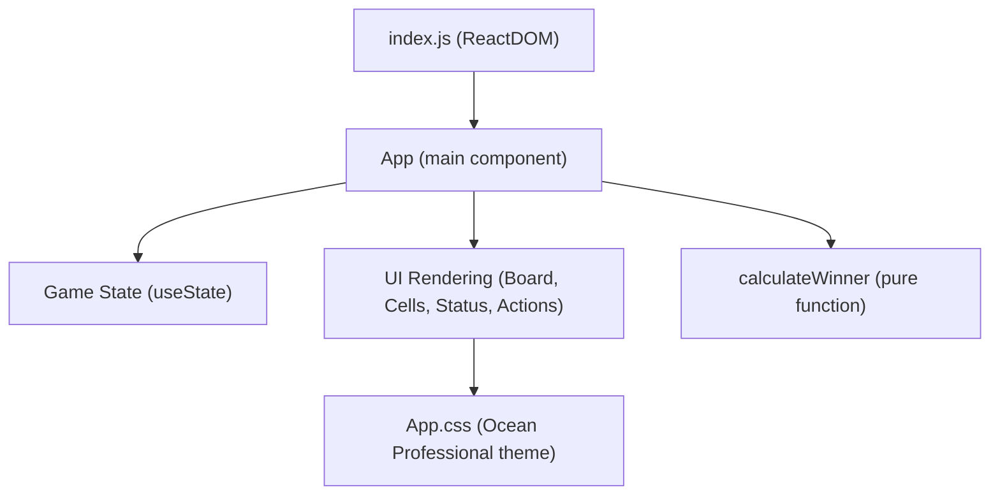

# Tic Tac Toe Frontend: Project Overview

## Introduction

### Purpose
This repository contains the web-based frontend for a classic two‑player Tic Tac Toe game built with React. The application provides an intuitive, responsive user interface that allows two human players to take turns, see game progress in real time, and restart the game once it ends. The UI follows the Ocean Professional theme with a modern, minimalist presentation.

### Scope
The frontend is responsible for rendering the game board, managing local game state, handling user interactions, and presenting the current status (turn indicator, win, or draw). There is no backend dependency in the current implementation.

## Features

### Gameplay
The application implements a full 3×3 Tic Tac Toe board with the following capabilities:
- Interactive cells that accept X and O moves in turn.
- Real-time calculation of the winner with highlight of the winning line.
- Draw detection when the board is full with no winner.
- Restart button to reset the game to an empty board.

### Accessibility and UX
- Semantic roles for grid and grid cells to help assistive technologies.
- Live region for status updates so screen readers are informed about turns and results.
- Consistent focus styles and hover states for interactive elements.

### Theming
- Ocean Professional theme using blue and amber accents.
- Modern, minimalist styling with rounded corners, subtle shadows, and smooth transitions.
- Theme tokens implemented as CSS variables.

## Architecture Overview

### High-Level Structure
- React single-page application (SPA) bootstrapped via Create React App scripts.
- A single top-level component (App) hosts the entire UI and encapsulates game logic.
- Styling is managed with plain CSS modules (App.css and index.css) without third-party UI frameworks.

### Files and Responsibilities
- src/index.js: Application entry point that renders App into #root.
- src/index.css: Global resets and base typography, colors, and layout defaults.
- src/App.js: Main React component; manages state, renders header, status, board, actions, and footer. Implements user interactions and uses calculateWinner to evaluate game outcomes.
- src/App.css: Theme tokens and component styles for the Ocean Professional look and feel.
- src/App.test.js: Basic unit test to ensure the app header renders.

## Main Components

### App Component
The App component encapsulates the entire game:

- State
  - board: An array of length 9 that stores the cell values: 'X', 'O', or null.
  - xIsNext: A boolean flag indicating who plays next (true for X, false for O).

- Derived Values
  - { winner, line } from calculateWinner(board) using useMemo for efficient recomputation.
  - isBoardFull: Computed from board.every(Boolean).
  - isDraw: True when there is no winner and the board is full.
  - currentPlayer: 'X' when xIsNext is true, otherwise 'O'.

- Event Handlers
  - handleSquareClick(idx): Ignores clicks on filled cells or after a game concludes; updates the board and toggles xIsNext.
  - handleRestart(): Resets board to all nulls and sets xIsNext to true.

- Rendering
  - Header: Title and subtitle.
  - Status: Shows current turn, winner, or draw using a live region.
  - Board: 9 interactive button cells (role="gridcell") rendered from the board array. Winning cells are highlighted.
  - Actions: A restart button to reset the game.
  - Footer: Theming note for Ocean Professional.

### Utility: calculateWinner
A pure function that checks all winning combinations (rows, columns, diagonals). It returns:
- winner: 'X' or 'O' when found, otherwise null
- line: An array of three indices for the winning cells, or an empty array when not determined

## Game State Management

### Data Model
- board: Array(9). Each index maps to one cell in the 3×3 grid.
- xIsNext: Boolean indicating current turn.
- winner, line: Derived from board via calculateWinner.
- isBoardFull, isDraw: Derived booleans for status and rendering.

### Update Flow
1. User clicks a cell.
2. handleSquareClick validates the move and updates the board.
3. State updates trigger recomputation of winner and draw status using useMemo, and React re-renders the UI.
4. When the game is finished, further clicks are ignored until reset.
5. handleRestart resets board and xIsNext to initial state.

## Usage Instructions

### Run in Development
- From the project root online-tic-tac-toe-146846-146855/tic_tac_toe_frontend:
  - npm start
- The app runs at http://localhost:3000 and hot reloads on changes.

### Run Tests
- npm test
- Includes a smoke test that verifies the header renders.

### Build for Production
- npm run build
- Outputs an optimized build to the build/ directory.

## Ocean Professional Theme and Style Guide

### Theme Tokens
The theme is implemented with CSS variables in src/App.css:
- --primary: #2563EB (blue)
- --secondary: #F59E0B (amber)
- --error: #EF4444 (error red)
- --bg: #f9fafb (background)
- --surface: #ffffff (surface)
- --text: #111827 (text)
- Additional tokens for shadows, radius, and focus ring ensure consistency.

### Application
- Layout: Centered container with a header at the top, a turn/status indicator beneath, the board in the middle, and a restart button below the grid. A small themed footnote appears at the bottom.
- Components:
  - Status chip: A pill-shaped element indicating the current player, a win, or a draw. Uses gradients and subtle shadows.
  - Board and Cells: A 3×3 grid with rounded corners, soft borders, and hover/focus states. Winning cells receive an amber highlight. Empty cells show a gentle hover glow.
  - Marks: X uses primary blue; O uses secondary amber for quick visual distinction.
  - Button: Restart button styled to match the card-like surfaces throughout.
- Interactions:
  - Hover, focus, and active states are animated with smooth transitions.
  - Focus-visible outlines utilize a soft primary-colored ring for accessibility.

### Modern Aesthetic
- Minimalist structure with clean typography.
- Subtle gradients to create depth without distraction.
- Rounded corners and soft shadows to create a cohesive card-like UI.

## Developer Setup

### Prerequisites
- Node.js 16+ and npm.
- No additional global tools are required.

### Installation
- Navigate to online-tic-tac-toe-146846-146855/tic_tac_toe_frontend
- Run npm install to install dependencies (react, react-dom, react-scripts).

### Linting
- ESLint is configured via eslint.config.mjs and the CRA eslintConfig.
- A rule ignores unused var warnings for React and App symbols to reduce noise during development.

## Extensibility

### Suggested Enhancements
- Scoreboard and History: Track wins and display a history of previous games.
- Move History and Undo: Record moves and allow stepping backward.
- AI Opponent: Add a simple AI for single-player mode using minimax or heuristics.
- Theming Support: Externalize theme tokens and add theme switching (e.g., light/dark).
- Persistence: Save and restore the last board state using localStorage.
- Animations: Animate mark placement and winning line.

### Architectural Considerations
- Componentization: Extract Board and Cell into separate components as the UI grows. Lift calculateWinner into a utilities module.
- State Management: For more complex features, consider useReducer or a lightweight state library. For now, useState and derived memoized values are sufficient.
- Accessibility: Preserve semantic roles and live announcements when adding new UI, and ensure focus management for keyboard users.

## Contribution Guidelines

### How to Contribute
- Fork the repository or create a feature branch.
- Follow the Ocean Professional theme tokens and interaction patterns.
- Maintain semantic HTML roles and ARIA attributes to support accessibility.
- Write or update tests for new UI behaviors or game logic.

### Code Style
- Prefer functional components and hooks.
- Keep pure logic (like calculateWinner) independent and easily testable.
- Use CSS variables for colors and spacing to ensure consistency.

### Pull Requests
- Include a clear description of changes and screenshots or gifs for UI updates.
- Ensure npm test passes and the app starts without errors.
- Keep changes scoped and focused; large refactors should be split when possible.

## Appendix

### Repository Structure
- tic_tac_toe_frontend/
  - src/
    - App.js
    - App.css
    - index.js
    - index.css
    - App.test.js
    - setupTests.js
  - package.json
  - eslint.config.mjs
  - README.md

### Test Coverage Note
Current tests only verify the header renders. Future contributions should consider adding:
- Click flow tests to place marks and detect wins/draws.
- Accessibility tests to validate roles and announcements.

## Conclusion

### Summary
This React application implements a polished, accessible, and modern Tic Tac Toe experience. The architecture is intentionally simple, with a single component managing state and rendering the UI, making it straightforward to maintain and extend. The Ocean Professional theme establishes a strong visual identity through consistent tokens, colors, and interactions, and the codebase is positioned for incremental enhancements such as AI, history, and theming options.
